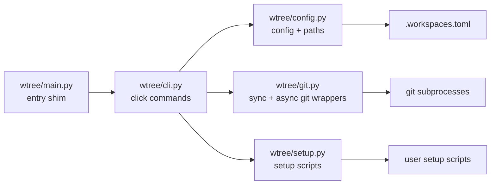
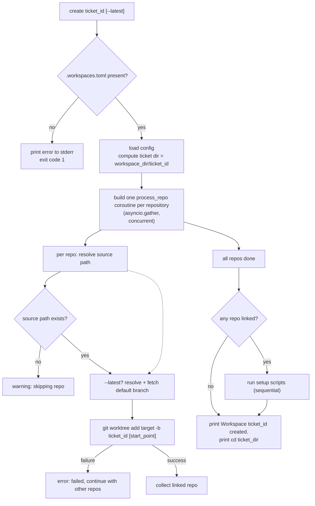

# Architecture

This document explains how wtree is structured, what each module is responsible for, how a `create` flows through the system, and the concurrency model that makes it fast.

## Project layout

```text
wtree/
├── __init__.py     # single source of truth for __version__
├── main.py         # entry shim: `wtree = wtree.main:cli`
├── cli.py          # click group + commands (init, create, clean) and async orchestration
├── config.py       # .workspaces.toml loading, dataclasses, path resolution
├── git.py          # git subprocess wrappers (sync + async) that raise GitError
└── setup.py        # setup script execution (subprocess, streamed output)
tests/
├── test_wtree.py   # end-to-end acceptance tests against real git repos
└── test_config.py  # config unit tests
```

## Module responsibilities

| Module | Responsibility |
| --- | --- |
| `cli.py` | Click command group. Each command is thin: it loads config, performs its work, and prints terminal output. `create` owns the `asyncio` event loop and the per-repo concurrent task graph. Output goes through `click.echo` / `click.secho` so colors and exit codes are consistent. |
| `config.py` | Parses `.workspaces.toml` into frozen dataclasses (`WorkspaceConfig`, `Repository`) using `tomllib`. Resolves source paths and the ticket directory. Writes the default config template for `init`. Raises `ConfigError` on missing/unreadable config. |
| `git.py` | All git access. Thin wrappers around `git` subprocesses (never a git library). Sync variants (`_run`, `add_worktree`, `latest_start_point`, ...) are used by `clean` and tests; async variants (`_arun`, `a_add_worktree`, `a_latest_start_point`, ...) are used by the concurrent path in `create`. Every failure raises `GitError` carrying the git stderr message. |
| `setup.py` | Runs executable setup scripts, streaming their output to the terminal. Returns the script's exit code (non-zero does not raise — the caller warns). Raises `SetupError` only when the script cannot be executed at all. |
| `main.py` | Entry point shim. Re-exports the `cli` group for the `wtree` console script. |

## Dependency graph



There are no cycles: `cli.py` depends on `config.py`, `git.py`, and `setup.py`; none of those depend back on `cli.py`.

## The `create` command flow



Key properties:

- **Per-repo isolation.** A failure in one repo (missing path, existing branch, fetch failure) is reported but never aborts the remaining repos.
- **Deterministic final output.** The workspace-level messages and the `cd` hint are printed after all repos complete.
- **Setup scripts run sequentially** after the worktree phase, never concurrently.

## Concurrency model

`create` is the only network-heavy command, and since the async support was added it uses a single-threaded `asyncio` event loop that fans out one coroutine per repository:

```mermaid
sequenceDiagram
    participant CLI as "click create command"
    participant Loop as "asyncio event loop (single thread)"
    participant R1 as "repo-frontend coroutine"
    participant R2 as "repo-backend coroutine"
    participant G1 as "git frontend (OS process)"
    participant G2 as "git backend (OS process)"

    CLI->>Loop: asyncio.gather(process_repo(x) for each repo)
    Loop->>R1: start coroutine
    Loop->>R2: start coroutine
    R1->>G1: spawn `git fetch origin main`
    R2->>G2: spawn `git fetch origin main`
    Note over R1,R2: both git processes run in parallel at the OS level
    G2-->>R2: fetch complete
    R2->>G2: spawn `git worktree add ...`
    G1-->>R1: fetch complete
    R1->>G1: spawn `git worktree add ...`
    G1-->>R1: worktree created
    R2-->>G2: worktree created
    R1-->>Loop: return result
    R2-->>Loop: return result
    Loop-->>CLI: gather returns (in config order)
```

What this model does and does not mean:

- **Real parallelism for the heavy work.** Each `asyncio.create_subprocess_exec` call spawns a real OS process. Multiple `git fetch` commands genuinely download from the network at the same time.
- **Cooperative scheduling on the Python side.** The event loop runs on one thread. When a coroutine `await`s a subprocess it yields control so other coroutines can spawn their own subprocesses. Python code never blocks on the git process.
- **No cross-repo locking.** Repos are independent working trees, so concurrent commands do not contend on git locks.
- **Output ordering is by completion, not config order.** Because repos finish at different times, the interleaved log lines reflect real-time progress rather than the config-file order.

For repos without a remote (`--latest` only), the async path resolves a local `main`/`master` branch and, if that fails, falls back to the current HEAD.

## Sync vs async functions in `git.py`

`git.py` intentionally ships both variants so no call site forces the other:

- **Sync** (`_run`, `add_worktree`, `remove_worktree`, `latest_start_point`, ...) — used by `clean` (a short, local-only command with no fan-out) and by the existing test suite, which shells out to real git.
- **Async** (`_arun`, `a_add_worktree`, `a_latest_start_point`, ...) — used by `create` for concurrent execution.

The two families share identical semantics, arguments, and error behavior (`GitError` with git's stderr attached). Adding a feature that touches git should keep both variants in sync.