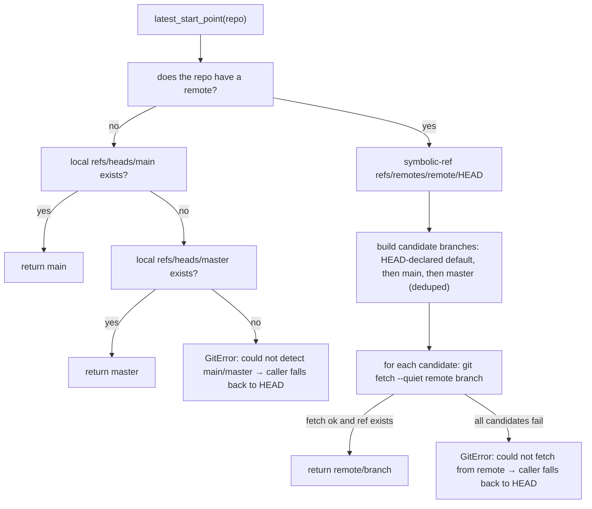
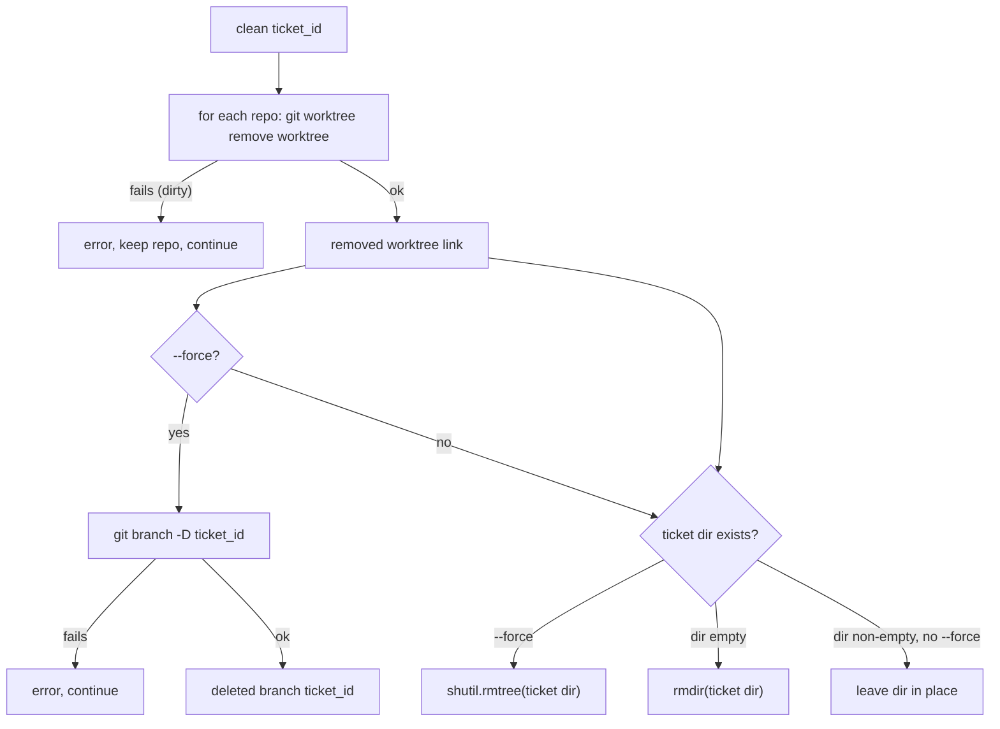

# CLI Reference

wtree exposes a single Click command group with three subcommands plus a version flag. All paths in the output (worktrees, `cd` hints) are printed as absolute paths.

## Cheat sheet

```sh
wtree --version                 # show installed version
wtree init                      # write a default .workspaces.toml
wtree init --force              # overwrite an existing .workspaces.toml
wtree create ticket-123         # worktree + branch ticket-123 in every repo
wtree create ticket-123 --latest   # base branches on latest main/master (fetches)
wtree clean ticket-123          # remove worktrees + empty ticket dir
wtree clean ticket-123 --force  # also delete branches, remove dirty/non-empty dirs
```

## Common behavior

- **Missing config.** If no `.workspaces.toml` is found, every command prints `Error: Config file not found at <path>` to **stderr** and exits with code **1**.
- **Branch name.** The branch created per repo is always the plain `<ticket-id>` — never a `feature/` prefix.

## `init`

```text
wtree init [--force]
```

Writes a starter `.workspaces.toml` into the current directory.

| Option | Description |
| --- | --- |
| `--force` | Overwrite an existing `.workspaces.toml`. Without it, an existing file causes an error (`exit code 1`) and the file is left untouched. |

The generated template uses `workspace_dir = "./.workspaces"` and two example repos: `./repo-frontend` and `./repo-backend`.

## `create`

```text
wtree create <ticket-id> [--latest]
```

Creates a worktree on branch `<ticket-id>` in **every** configured repository. All repos are processed concurrently (see [Architecture](./architecture.md#concurrency-model)); setup scripts then run sequentially.

| Option | Description |
| --- | --- |
| `--latest` | Detect and fetch each repo's default branch first, then cut the ticket branch from it. If detection or fetch fails for a repo, a warning is printed and that repo falls back to its current HEAD. |

### `--latest` default-branch resolution



Resolution order in plain words:

1. The remote's HEAD symref (`refs/remotes/<remote>/HEAD`, preferring `origin`).
2. `main` then `master` on the remote (each fetched).
3. If the repo has **no remote**, local `main` then `master`.
4. If none resolve, the repo prints the same warning as a fetch failure and falls back to current HEAD.

### Output

`create` ends with two lines:

```text
Workspace ticket-123 created.
cd /absolute/path/to/workspaces/ticket-123
```

Both are printed only after all repos and setup scripts finish, so the `cd` hint is always valid.

## `clean`

```text
wtree clean <ticket-id> [--force]
```

Removes the workspace: each repo's worktree is removed, then the ticket root directory is removed **if and only if it is empty**.

| Option | Description |
| --- | --- |
| `--force` | Remove dirty worktrees (`git worktree remove --force`), delete the ticket branches (`git branch -D`), and remove the ticket directory even if it still contains files. |



## Exit codes

| Code | Condition |
| --- | --- |
| 0 | Success (including per-repo warnings — `create`/`clean` never fail because one repo failed). |
| 1 | Configuration error: missing/invalid `.workspaces.toml`, or `init` refusing to overwrite without `--force`. |

Note that setup-script failures and per-repo git failures print warnings/errors but **do not** change the exit code.