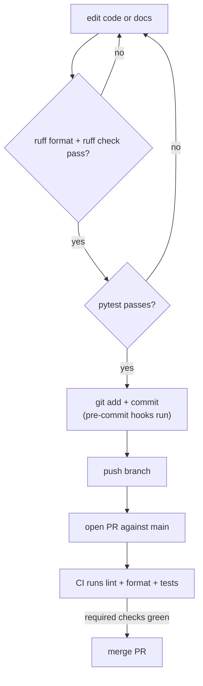

# Contributing

Thank you for contributing to wtree. This guide covers setting up a development environment, the tooling, and the conventions to follow.

## Development setup

Prerequisites: **Python >= 3.11** and `git`.

```sh
# clone and install in editable mode with dev dependencies
git clone <your-fork-url> wtree
cd wtree
python -m venv .venv && source .venv/bin/activate
pip install -e ".[dev]"
```

The `[dev]` extras install `pytest`, `ruff`, `pre-commit`, and `bump-my-version`.

## Tooling

| Tool | Command | Purpose |
| --- | --- | --- |
| pytest | `pytest` | Run the full test suite. |
| ruff (lint) | `ruff check .` | Static linting. |
| ruff (format) | `ruff format .` | Formatting (line length 100). |
| pre-commit | `pre-commit run --all-files` | Runs `ruff --fix` + `ruff-format` on every commit. |
| bump-my-version | `bump-my-version bump patch\|minor\|major` | Version bumps (see [Releasing](./releasing.md)). |

Ruff is configured in `pyproject.toml` (`select = ["E", "F", "I", "UP", "B"]`, `target-version = "py311"`, `line-length = 100`) and wired into `.pre-commit-config.yaml`.

### Disabling GPG signing for local version bumps

Local `bump-my-version` commits and tags will fail in headless environments if GPG signing is enabled. If you bump versions locally, run:

```sh
git config commit.gpgsign false
git config tag.gpgsign false
```

## Development workflow



## Conventions

- **Branch naming.** Ticket branches are always the plain `<ticket-id>` (e.g. `ticket-123`), never a `feature/` prefix. This applies to the worktrees wtree creates and to test fixtures.
- **Tests create real git repos.** Acceptance tests shell out to real `git`. Fixture repos must set `git config commit.gpgsign false`, because commits fail in headless environments (CI) when signing is enabled globally.
- **Sync + async in parallel.** `git.py` keeps sync and async variants of every git wrapper (see [Architecture](./architecture.md#sync-vs-async-functions-in-gitpy)). A new git operation should ship both.
- **Keep behavior documented.** When adding or changing commands, flags, or environment variables, update **AGENTS.md** and **README.md** (and `docs/` where relevant) in the same change.
- **Per-repo errors are not fatal.** `create` continues with remaining repos when one repo fails. Preserve this fault-tolerant behavior in tests.
- **Why directories exist.** `.workspaces/` is the default runtime workspace root — it is git-ignored, never commit it.

## Commit style

- Keep the message short and describe the *change*, e.g. `Add async fetch support to create --latest`.
- Follow the existing history style — lowercase imperative, no trailing period.

## Testing your change

```sh
ruff check .
ruff format .        # may rewrite files; re-run ruff check after
pytest
pre-commit run --all-files
```

If you touch the async path, run the suite a few times; concurrency-sensitive assertions can be flaky. See [Testing](./testing.md) for the fixture inventory.