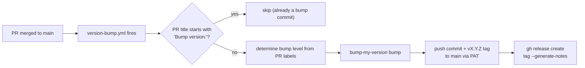

# Releasing

Releases are **fully automated** when a PR is merged to `main`. There is no manual version file to edit — the workflow runs `bump-my-version` based on labels attached to the PR.

## Pipeline overview



The entire pipeline runs in a single job on `ubuntu-latest`. It is deliberately simple: no matrix builds, no release branches.

## Version bump details

| PR label | Bump level | Example result |
| --- | --- | --- |
| `major` | major | `0.4.0` → `1.0.0` |
| `feature` | minor | `0.4.0` → `0.5.0` |
| *(no label)* | patch | `0.4.0` → `0.4.1` |
| `major` + `feature` | major wins | `0.4.0` → `1.0.0` |

`bump-my-version` writes the new version to:

- `wtree/__init__.py` (single source of truth for `__version__`)
- `pyproject.toml` (in `current_version`)
- A `vX.Y.Z` tag

## Guard: self-retrigger prevention

The workflow only fires on `pull_request` `closed` events on `main`. To prevent the bump commit's own push from creating an infinite loop, the workflow:

1. Requires `github.event.pull_request.merged == true`.
2. Skips PRs whose title starts with `Bump version:` — so a maintainer can merge a manual bump without triggering another one.

A direct push to `main` (bypassing a PR) does **not** trigger the workflow because it is gated on the `pull_request` event.

## Setup requirements

| Requirement | Where |
| --- | --- |
| **Personal access token** (fine-grained, Contents: read/write) | Stored as the `VERSION_BUMP_PAT` repository secret. Used to push the bump commit, push the tag, and create the GitHub release. |
| **Branch protection** on `main` | Requires 1 approval + status checks (CI passes). Admin bypass is enabled intentionally so the PAT push succeeds. |
| **`feature` and `major` labels** | Must exist in the repository (Settings → Labels). Apply the appropriate label to a PR before merging. |

## What the version string means

`pyproject.toml` uses:

```toml
tag_name = "v{new_version}"
```

At tag time, `{new_version}` resolves to the **post-bump** version (e.g. `1.0.0`), producing a tag like `v1.0.0`. The pre-bump `{current_version}` is **not** used for tagging.

## Performing a release

Nothing manual — just merge PRs:

1. Add a `feature` label (for minor) or `major` label (for breaking change) to the PR.
2. Ensure CI is green and merge.
3. The workflow handles bump, push, tag, and GitHub release automatically.

If a PR should **not** bump the version (e.g. a docs-only change), omit the labels and it defaults to patch — which is usually fine. If you truly want to skip a release, title the PR `Bump version: ...` and the workflow skips it.

## Local version bumps

You can run `bump-my-version` locally to preview or force a specific version:

```sh
git config commit.gpgsign false   # required in headless environments
git config tag.gpgsign false
bump-my-version bump patch
```

This commits locally but does not push. Verify the result, then push and tag yourself.