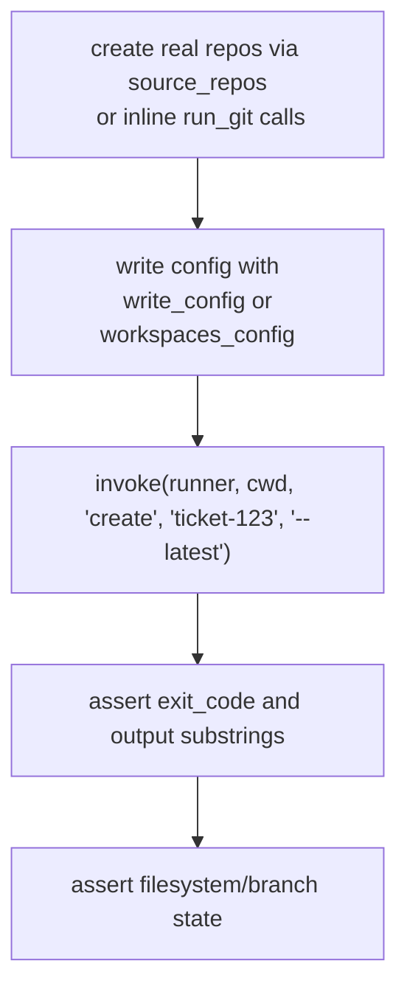

# Testing

wtree uses **pytest**. The suite is split into two files that exercise the code at very different levels.

```sh
pytest              # run everything
pytest tests/test_config.py   # config unit tests only
pytest tests/test_wtree.py    # acceptance tests only
```

## Test layout

| File | Level | What it covers |
| --- | --- | --- |
| `tests/test_config.py` | Unit | `WorkspaceConfig.from_dict` parsing and defaults, `load_config` (incl. missing-file error), `ticket_dir` resolution, `resolve_source_path`, `write_default` overwrite rules. Pure `tmp_path`, no git involved. |
| `tests/test_wtree.py` | Acceptance / end-to-end | The actual CLI via `click.testing.CliRunner` against **real git repositories** created on disk: `init`, `create` (plain, `--latest`, failure isolation, path styles), `clean` (with/without `--force`), and setup-script behavior. |

## Key idea: tests drive real git

Acceptance tests do not mock subprocesses or git. They initialize real repos with `git init`, commit files, add remotes, push to bare repos, and then assert on the filesystem and branch state after running `wtree` through `CliRunner`.

This means the async `create` path is tested end-to-end: coroutines are launched, real subprocesses spawned, and the resulting worktrees inspected.

## Fixtures and helpers in `tests/test_wtree.py`

| Name | Type | Purpose |
| --- | --- | --- |
| `source_repos` | fixture | Creates two git repos (`frontend`, `backend`) at `tmp_path/source/repo-<name>`, each with one commit and `commit.gpgsign false`. |
| `workspaces_config` | fixture | Writes a `.workspaces.toml` at `tmp_path/cwd` pointing at both `source_repos`. |
| `runner` | fixture | A `click.testing.CliRunner`. |
| `invoke(runner, cwd, *args)` | helper | `os.chdir(cwd)` then runs `runner.invoke(cli, args)`. Returns the `Result`. |
| `run_git(repo, *args)` | helper | Runs a real git command in `repo`, asserting exit code 0. |
| `branch_exists(repo, branch)` | helper | Checks whether a branch exists in a repo. |
| `write_config(cwd, text)` | helper | Creates `.workspaces.toml` from a string. |
| `write_script(path, content, executable=True)` | helper | Writes a script, optionally `chmod +x`. |
| `commit_file(repo, name, content)` | helper | Writes + commits a file in a repo. |
| `repos_config(tmp_path, source_repos, extra="")` | helper | Returns a two-repo config string with an inserted `extra` block (used to add a `setup_script` line). |

### The GPG pitfall

Repo-creating fixtures must set `git config commit.gpgsign false`. If `commit.gpgsign` is enabled globally in the environment, `git commit` fails in headless environments (notably CI) because there is no signing key. Every test repo that commits sets this before its first commit.

## Assertions you will see in acceptance tests

- `.exit_code == 0` (or `== 1` for the missing-config error).
- Substrings of the CLI output (`"Workspace ticket-123 created."`, `"Based on latest origin/main."`, `"Failed to create worktree for frontend"`, `"Running workspace setup script..."`).
- Filesystem state: `worktree.is_dir()`, files exist inside worktrees, ticket root removed after `clean`.
- Branch state via `branch_exists(repo, "ticket-123")`.
- Env-var handoff: setup scripts write `WTREE_*` values into marker files that tests then read.

## CI

The `ci` workflow (`.github/workflows/ci.yml`) runs on `push` to `main` and on every PR:

```text
pip install -e ".[dev]"  →  ruff check .  →  ruff format --check .  →  pytest
```

Branch protection on `main` requires this job to pass before a PR can merge.

## Adding a test



Example skeleton:

```python
def test_something(runner, tmp_path, source_repos):
    cwd = write_config(
        tmp_path / "cwd",
        repos_config(tmp_path, source_repos, extra='setup_script = "./scripts/setup.sh"\n'),
    )
    write_script(cwd / "scripts" / "setup.sh", "#!/bin/sh\ntouch marker.txt\n")

    result = invoke(runner, cwd, "create", "ticket-123")

    assert result.exit_code == 0
    assert "Setup complete for workspace." in result.output
    assert (tmp_path / "workspaces" / "ticket-123" / "marker.txt").exists()
```

If you add a concurrency-relevant behavior, run the suite repeatedly (`pytest` a few times) to catch order-sensitive flakiness.